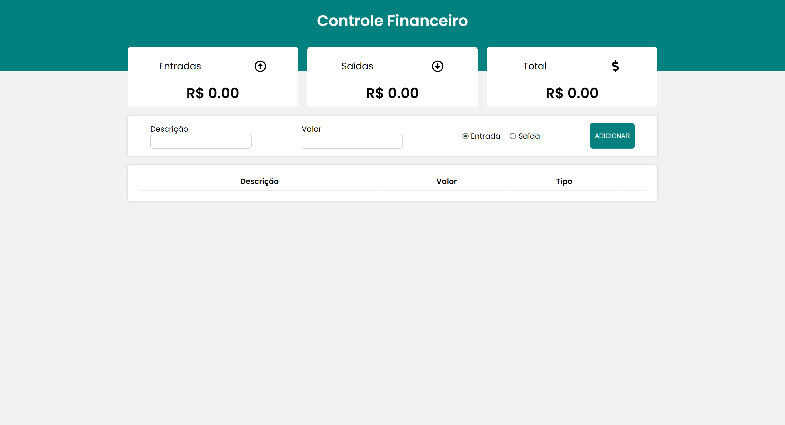
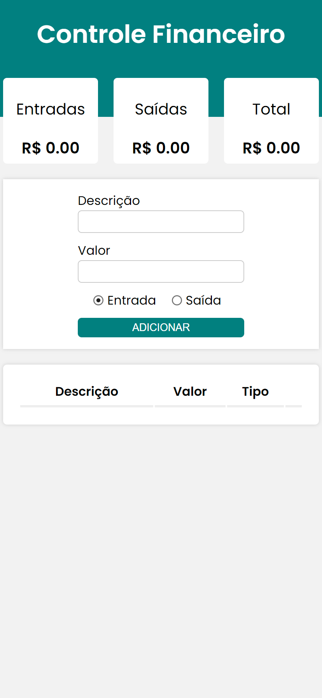

# Financial Control

> Financial control app, to add input and output value with details about them. The app stores your information in the local database, that is, if you exit and/or reload the page, your expenses and earnings will still be there.

## Table of contents

- [Overview](#overview)
  - [The challenge](#the-challenge)
  - [Links](#links)
  - [Screenshot](#screenshot)
- [My process](#my-process)
  - [Built with](#built-with)

## Overview

### The challenge

Users should be able to:

- Be able to enter expenses
- Be able to enter entries
- Be able to observe all expenses and entries
- View remaining total
- Delete added information
- Insert new information
- Store information in the local database

### Links

- Live Site URL: https://financial-control-rafael.netlify.app

### Screenshot

  - Desktop
  
    
    
  - Mobile
    
    

## My process

### Built with

- REACT JS
- HTML
- CSS
- JAVASCRIPT

[⬆ Back to the top](#financial-control) 
